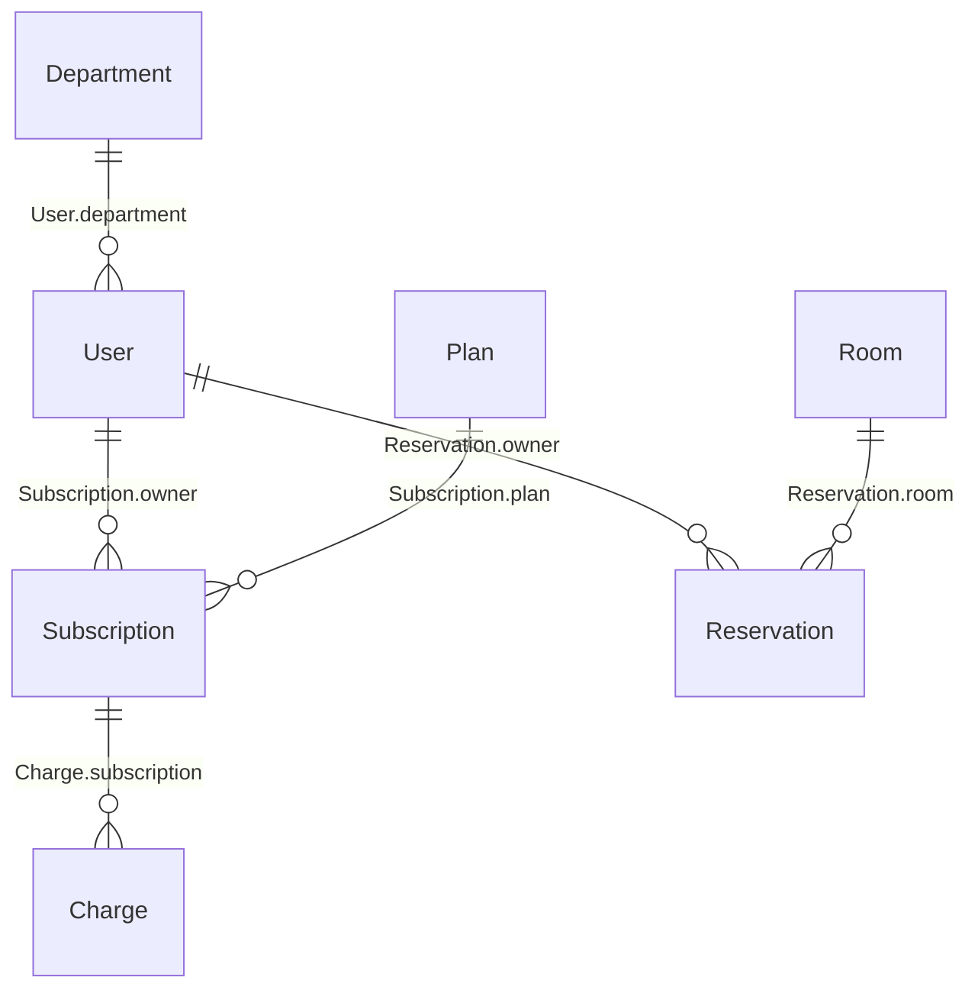
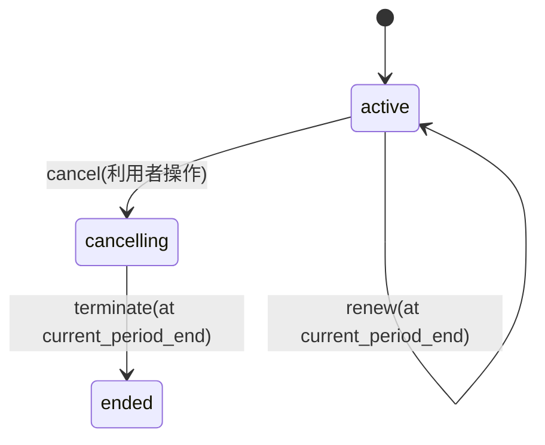

# WORKFLOW — fspec 仕様から設計を導出する

## 0. 位置づけとパイプライン

```
要件(自然言語 + REQ-ID)
   │  AI が fspec を書く。要件との対応は trace "REQ-..." で結線
   ▼
fspec 仕様セット (*.fspec) ← 人間はここをレビューする(単一の真実)
   │  fspec check   … 整合性 W-01..11 / 網羅性 C-01..08(SPEC §7)
   │  fspec build   … SpecIR(JSON)を生成(SPEC §9)
   ▼
SpecIR ──┬─ fspec derive … 基本設計の入力 D-01〜D-07(本書 §1)
         ├─ 詳細設計への導出(本書 §3)
         └─ Web アプリのランタイム参照(本書 §5)
```

原則: **導出物は成果物リポジトリにコミットするが、手で編集しない。** 直したくなったら
fspec を直して再導出する。導出はすべて SpecIR の走査だけで完結する決定的アルゴリズム
であり、LLM を挟まない。以下の各 D に走査手順と、example から実際に導出した
サンプルを示す。

## 1. 基本設計の入力(fspec derive)

### D-01 ドメインモデル / データ設計入力

アルゴリズム: 全 entity を列挙し、(1) フィールド表(型・unique・optional・external)、
(2) `ref` フィールドから関係辺、(3) lifecycle から状態カラム、を出力する。
derive フィールドは「導出属性(非永続)」として区別して載せる。



テーブル設計への機械的対応: entity → テーブル、`ref E` → E への FK、`unique` →
一意制約、lifecycle フィールド → 状態カラム(値域 = 状態集合)、derive → 実装しない
(またはビュー)、external → 本システムでは読み取り専用の参照テーブル。

### D-02 権限マトリクス

アルゴリズム: 全 behavior × 全 actor の表を作り、セルに allow 節の有無と `where` 式
(整形出力)を入れる。allow の無いセルは `—`。

| behavior | member | dept_admin | system_admin |
|---|---|---|---|
| subscribe | ✓ | ✓ | ✓ |
| change_plan | ✓ | ✓ | ✓ |
| cancel_subscription | ✓ | ✓ | ✓ |
| my_current_period_charges | ✓ | ✓ | ✓ |
| create_reservation | ✓ | ✓ | ✓ |
| cancel_reservation | `target.owner == caller` | `target.owner.department == caller.department` | ✓ |
| force_reserve ⚠audit | — | — | ✓ |
| list_my_reservations | ✓ | ✓ | ✓ |
| list_department_reservations | — | ✓ | — |
| list_all_reservations | — | — | ✓ |

(この表が example の allow 節から一意に得られる。手書きの権限一覧表は作らない。)

### D-03 状態遷移図とタイマー/バッチ一覧

アルゴリズム: lifecycle ごとに状態遷移図を出力。`at` 付き遷移は
(エンティティ, 遷移, 発火時刻式, ガード, effect 要約) をスケジューラ設計表として別掲。



| スケジューラ項目 | 発火時刻 | 内容(effect 要約) |
|---|---|---|
| Subscription.renew | `current_period_end` | pending_plan 適用 → 月額課金 → 期間更新 |
| Subscription.terminate | `current_period_end` | 状態遷移のみ |

→ 基本設計では「期限到来ジョブ」2 件と、`now = 発火予定時刻` で評価するという
実装制約(SPEC §6.3)がそのまま要件になる。

### D-04 API 操作カード(behavior ごと)

アルゴリズム: behavior ごとに次を出力する。
入力スキーマ = input 節の型を JSON Schema 化。認可 = allow 節。事前条件 = require 列
(宣言順 = 評価順)。適用 rule = 書き込み集合から導出(`derived.rules_by_behavior`)。
エラーカタログ = `FORBIDDEN` + `INVALID_INPUT` + require のコード + effect が起動する
遷移のコード + 適用 rule のコード(静的な上界。到達しない候補も含む保守的近似)。

例: `cancel_reservation` の導出結果:

```yaml
operation: cancel_reservation
authorization:
  member:       "input.target.owner == caller"
  dept_admin:   "input.target.owner.department == caller.department"
  system_admin: unconditional
input: { target: { $ref: Reservation } }
preconditions:                       # 評価順
  - { cond: "now < input.target.starts_at", error: RESERVATION_ALREADY_STARTED }
effects:                             # 逐次
  - transition Reservation.cancel (input.target)
  - conditional create Charge (reason=late_cancellation, amount=cancellation_charge(target))
applied_rules:                       # 書き込み集合 {Reservation, Charge} から導出
  [no_double_booking, reservation_time_valid, reservation_within_subscription]
errors: [FORBIDDEN, INVALID_INPUT, RESERVATION_ALREADY_STARTED,
         CANNOT_CANCEL_RESERVATION, RESERVATION_OVERLAP, INVALID_TIME_RANGE,
         NO_ACTIVE_SUBSCRIPTION]     # rule 由来は静的上界
audit: false
```

これがエンドポイント設計(パス・メソッド割当は設計層の裁量)、リクエスト/レスポンス
定義、エラーレスポンス表の入力になる。

### D-05 バリデーションカタログ(entity ごと)

アルゴリズム: entity ごとに、掛かる rule(+ unique 自動 rule)を
(rule 名, 適用条件 when, 述語, エラーコード) の表にする。フロントエンドの
フォーム検証・バックエンドの検証は、この表(実体はランタイムの `validate`)を
共通の根拠とする。

| Reservation の制約 | 条件 | エラー |
|---|---|---|
| reservation_time_valid | 常時 | INVALID_TIME_RANGE |
| no_double_booking | status == confirmed | RESERVATION_OVERLAP(system_admin は force_reserve で上書き可) |
| reservation_within_subscription | confirmed かつ未来 | NO_ACTIVE_SUBSCRIPTION |

### D-06 テスト骨子

アルゴリズム: behavior ごとに (a) 正常系 1 件、(b) require ごとに境界の異常系、
(c) 適用 rule ごとに違反ケース、(d) allow 節ごとに許可/拒否ケース、(e) effect 内の
`when` 分岐ごとに両分岐、を機械列挙する。例: `cancel_reservation` からは
「期限前取消(課金なし)/期限後取消(全額課金)/開始後取消(棄却)/他人の予約
(member 拒否・同部門 dept_admin 許可)…」が列挙される。期待値の具体データは
テスト設計者(または AI)が埋めるが、**ケースの網羅リスト自体は導出物**。

### D-07 影響範囲レポート(変更管理)

変更手順:

1. fspec を編集する(例: `cancellation_notice` の意味を変える、
   `Reservation.cancel_deadline` の式を変える)。
2. `fspec impact <修飾名>` で逆推移閉包を得る(SPEC §8)。
   例: `impact(Reservation.cancel_deadline)` →
   `cancellation_charge` → `cancel_reservation`(+ その導出物 D-04/05/06 のカード)。
3. `fspec check` で W/C 検査。`fspec derive` を再実行し、**導出物の diff** を
   レビュー対象にする。影響リストに現れた behavior の設計・実装・テストだけを
   見直せばよいことが機械的に保証される。

## 2. 基本設計書テンプレートとの対応

| 基本設計書の章 | 導出元 |
|---|---|
| ドメインモデル / ER 図 | D-01 |
| テーブル定義(論理) | D-01(物理設計は設計層で追記) |
| 権限一覧 | D-02 |
| 状態遷移設計 | D-03 |
| バッチ/ジョブ一覧 | D-03 |
| API 一覧・入出力・エラー | D-04 |
| 入力チェック仕様 | D-05 |
| テスト観点表 | D-06 |
| 監査対象操作一覧 | behavior の `audit` フラグの列挙 |
| 要件トレーサビリティ表 | 全宣言の `trace` を REQ-ID で転置集計 |

設計層で**追加する**もの(仕様に無いことが仕様): 画面設計、物理データ設計、
エンドポイント URL 設計、性能・運用設計、エラー文言、外部連携(決済)設計。
RATIONALE §4 の除外リストがそのまま「設計層で決めるべきことリスト」になる。

## 3. 詳細設計への導出

- **calc → 純関数仕様**: シグネチャ・式をそのまま関数設計に写す。数値は
  有理数演算 + 明示丸め(SPEC §3.2)なので、実装言語の decimal ライブラリ選定と
  丸め箇所が仕様から一意に決まる。`proration_charge` はそのまま
  日割り計算関数の詳細設計である。
- **behavior → トランザクションスクリプト**: SPEC §6.2 のパイプライン
  (入力検証 → 認可 → 事前節 → effect 逐次 → rule 検査 → コミット)が処理フローの
  骨格。effect 文列は擬似コードとして 1:1 に転記できる。
- **lifecycle → 実装制約**: 状態カラムは transition 実装以外から更新しないこと、
  タイマーは「発火予定時刻を now として評価」すること、が実装規約になる。
- **rule → 検証実装**: ランタイム(§5)を使うなら実装不要(SpecIR を評価)。
  独自実装するなら D-05 の表が検証ロジックの仕様。

## 4. AI 運用ループ

1. 要件(REQ-ID 付き)を入力に、AI が fspec を書く/変更する。
2. `fspec check` が W/C エラーを返す間は AI が修正する(このループに人間は不要。
   検査が決定的なので「直ったかどうか」が曖昧にならない)。
3. 人間は (a) fspec 本文の diff、(b) 導出物の diff、(c) `impact` の一覧、をレビューする。
   自然言語の doc はレビューの補助であり、判定の根拠は常に式・構造の側。
4. 承認後、設計層(人間または AI)は D-01〜D-07 を入力に基本設計を書き、
   trace チェーン(REQ → fspec 宣言 → 設計章)を保つ。

## 5. Web アプリランタイムでの参照

SpecIR をアプリに同梱し、ランタイム(SPEC §9.2)経由で参照する。

| 用途 | API | 例 |
|---|---|---|
| 画面制御(ボタン活性・メニュー表示) | `can(behavior, ctx)` | 予約一覧の「取消」ボタンを `can("cancel_reservation", {caller, input:{target}})` で行ごとに制御 |
| フォームのライブ検証 | `validate(behavior, ctx)` | 予約フォームで RESERVATION_OVERLAP / PLAN_LIMIT_REACHED を送信前に提示 |
| 実行(サーバ側) | `execute(behavior, ctx)` | API ハンドラは認可・検証・効果・不変条件検査をランタイムに委譲 |
| 請求プレビュー | `calc(name, args)` | プラン変更画面で `proration_charge` を表示(実行時と同じ式なので金額が食い違わない) |
| 期限処理 | `pendingTimers(ref)` | renew / terminate をジョブキューに登録 |
| エラー表示 | `errorCatalog(behavior)` | コード→文言表(設計層成果物)と突き合わせ |

サーバとフロントが同一の SpecIR を読むため、「バリデーションが画面とサーバで違う」
「ボタンは押せたのにサーバで拒否される」という不整合が構造的に起きない
(認可のスコープ条件・制約・計算のすべてが単一定義点から評価されるため)。
